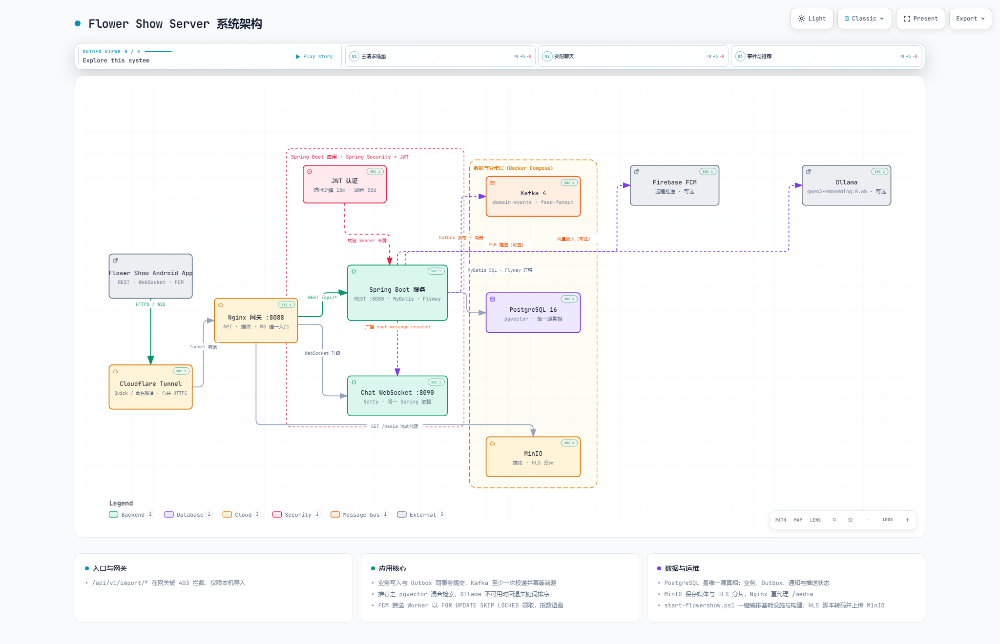

[English](README.md) | **简体中文**

# Flower Show Server

Flower Show Android 应用的 REST 后端。

## 系统架构



GitHub 会显示上面的静态预览。如需交互式版本，请[下载 HTML 文件](docs/architecture/flower-show-server-architecture.html)并在本地打开。

## 环境要求

- JDK 17+
- Maven 3.9+
- PostgreSQL 16+（带 pgvector）和 Kafka 4+，或 Docker

应用默认使用 PostgreSQL。Flyway 会在启动时运行数据库迁移。

## 本地数据库

使用 Docker 启动本地基础设施：

```bash
docker compose up -d kafka postgres minio minio-init nginx
docker compose ps
```

Compose 使用的 PostgreSQL 镜像包含 pgvector。语义搜索是可选功能，默认使用
带有 `qwen3-embedding:0.6b` 的本地 Ollama 容器：

```powershell
docker compose --profile semantic up -d ollama
docker compose --profile semantic run --rm --no-deps ollama-model
```

默认连接信息：

```text
jdbc:postgresql://localhost:5432/flower_show
user: flower_show
password: flower_show
```

使用环境变量覆盖连接信息：

```bash
DB_URL=jdbc:postgresql://localhost:5432/flower_show
DB_USERNAME=flower_show
DB_PASSWORD=flower_show
```

身份验证使用签名 JWT 访问令牌。生产环境请设置至少包含 32 个 UTF-8 字节的密钥：

```powershell
$env:JWT_SECRET = 'replace-with-a-long-random-production-secret'
```

本地开发时如果未设置 `JWT_SECRET`，服务器会创建
`data/jwt-secret.local`。该文件已被 Git 忽略，并会在重启之间复用。

## 运行

支持的一键启动路径会在 Nginx 网关后启动 Spring Boot 应用：

```powershell
powershell -ExecutionPolicy Bypass -File .\scripts\start-flowershow.ps1
```

该脚本会：

- 启动 PostgreSQL、Kafka、MinIO 和 Nginx；
- 验证并重新加载 Nginx，然后启动已配置的或临时的
  Cloudflare Tunnel；
- 使用 JDK 17 构建 Spring 服务，并在主机端口 `8080` 上启动；
- 等待 Spring 服务的本地网关和公网网关健康检查通过；
- 推导出一个用于 API 和媒体的公网网关 URL，并将其同步到
  Android 项目的 `gradle.properties`。

使用相同的启动路径启用混合向量搜索和语义个性化：

```powershell
powershell -ExecutionPolicy Bypass -File .\scripts\start-flowershow.ps1 `
  -EnableSemanticSearch
```

首次运行时，Docker 会下载 Ollama 和嵌入模型。后续启动会复用本地模型卷。如果 Ollama
不可用，Spring 服务仍会保持运行，并自动使用数据库现有的关键词和基于规则的排序。
覆盖 `EMBEDDING_MODEL` 时，启动脚本会为 `OLLAMA_MODEL` 使用相同的值，除非显式设置了
`OLLAMA_MODEL`。

`8088` 上的 Nginx 是 App/Cloudflare API 的唯一入口。同一个 Spring
服务处理所有 `/api/` 路由，包括以下四个推荐接口：

- `POST /api/v1/feed/pages`
- `POST /api/v1/search/guesses`
- `POST /api/v1/search/videos`
- `POST /api/v1/events:batch`

旧版 `GET /api/v1/search` 以及其余现有 API 也使用同一个服务。Spring 仍负责 PostgreSQL、
JWT、内容、社交功能、互动、通知和推荐状态。
`events:batch` 仅用于推荐反馈，不会替代 Spring 的持久化互动 API。

Spring 后端 PID 文件以及带时间戳的标准输出/标准错误日志会写入
`target/runtime`。服务健康检查失败时会打印相应的日志尾部。重启时，脚本只有在命令行确认
某个已有的 `8080` 监听器属于 Flower Show Spring 后端时，才会停止它。

只有在 Spring 构件已经存在后，才使用跳过构建开关：

```powershell
powershell -ExecutionPolicy Bypass -File .\scripts\start-flowershow.ps1 `
  -SkipServerBuild
```

如需同时在已连接的手机上构建并安装调试 App：

```powershell
powershell -ExecutionPolicy Bypass -File .\scripts\start-flowershow.ps1 `
  -SkipServerBuild `
  -InstallApp
```

未配置命名隧道时，脚本会使用 Quick Tunnel。由于网关地址会编译进 APK，新的 Quick
Tunnel URL 需要重新构建 App。

Kafka 模式是常规的集成环境：

```powershell
$env:KAFKA_ENABLED = 'true'
$env:LOCAL_EVENT_DISPATCHER_ENABLED = 'false'
$env:KAFKA_BOOTSTRAP_SERVERS = 'localhost:9092'
$env:MEDIA_PUBLIC_BASE_URL = 'http://localhost:8088/media'
mvn spring-boot:run
```

在不使用 Kafka 的后端专用 IDEA 会话中，省略这些变量即可。本地分发器会消费相同的
Outbox 事件，因此功能开发仍然可以形成完整闭环。

```bash
mvn spring-boot:run
```

REST 服务器监听 `http://localhost:8080`。同一个 Spring Boot 进程还会在
`ws://localhost:8090/ws/chat` 上启动内部 Netty 聊天 WebSocket 监听器。

### 实时聊天 WebSocket

默认拓扑会将 TLS 和公网入口保留在 Nginx/Cloudflare，而 Spring 管理的 Netty 监听器仍然是普通的内部 WebSocket：

```text
App -- wss://public-host/ws/chat --> Cloudflare/Nginx :8088
                                      |
                                      +-- ws://host.docker.internal:8090/ws/chat
                                          (same Spring Boot process as REST :8080)
```

当网关通过 HTTPS 发布时，外部客户端必须使用 `wss://{public-host}/ws/chat`。
`ws://host.docker.internal:8090/ws/chat` 是 Nginx 到 Netty 的内部跳转；不应将端口 `8090`
作为公共 TLS 端点暴露。直接进行本地诊断时，请使用 `ws://localhost:8090/ws/chat`。

监听器使用以下统一的 Spring 配置和环境变量覆盖项：

```yaml
flower-show:
  chat:
    websocket:
      enabled: true
      port: 8090
      path: /ws/chat
      idle-timeout: 60s
      max-frame-payload-length: 8192
```

```powershell
$env:CHAT_WEBSOCKET_ENABLED = 'true'
$env:CHAT_WEBSOCKET_PORT = '8090'
$env:CHAT_WEBSOCKET_PATH = '/ws/chat'
$env:CHAT_WEBSOCKET_IDLE_TIMEOUT = '60s'
$env:CHAT_WEBSOCKET_MAX_FRAME_PAYLOAD_LENGTH = '8192'
```

Nginx 当前将固定的公网路由 `/ws/chat` 代理到内部端口 `8090`；修改路径或端口时也必须同步修改 Nginx 路由。
常规测试会禁用监听器。专用的网关集成测试会使用端口 `0` 启用它，以便操作系统选择可用端口。

Upgrade 请求必须包含 `Authorization: Bearer {accessToken}`。网关使用与 REST 相同的
`JwtDecoder`，包括签名、签发者、受众和过期时间校验，并使用 JWT `sub` 作为用户 ID。
访问令牌过期时，网关会以代码 `4001` 关闭通道，使 App 通过常规的令牌刷新路径重新连接。
连接成功后会收到：

```json
{"type":"connection.ready"}
```

消息创建仍然是 REST 写入操作。WebSocket 不接受业务消息写入；它唯一的文本输入是类似下面的 ACK：

```json
{"type":"ack","eventId":"evt_..."}
```

ACK 会被校验但不会持久化。服务器 Ping、客户端 Pong、关闭处理、配置的空闲超时以及最大帧大小会共同限制连接资源。
每个用户可以持有多个并发通道，其所有设备都会收到相同的事件：

```json
{
  "type": "chat.message.created",
  "eventId": "evt_...",
  "occurredAt": "2026-07-30T04:00:00Z",
  "message": {
    "id": "msg_...",
    "conversationId": "con_...",
    "senderUserId": "user-a",
    "senderNickname": "Alice",
    "senderAvatarUrl": null,
    "type": "text",
    "text": "hello",
    "sharedContent": null,
    "clientMessageId": "android-local-42",
    "createdAt": "2026-07-30T04:00:00Z"
  }
}
```

`message` 的形状与 REST 的 `ChatMessageDto` 完全一致。投递是在线提示，而不是第二个消息存储：
客户端按 `message.id` 去重，并使用现有 REST 历史接口恢复缺失消息。PostgreSQL 仍然是事实来源。
本地分发器和 Kafka 监听器都会到达同一个 `DomainEventProcessor`；默认可靠的 Outbox 轮询间隔是
`100ms`，Kafka 和 Netty 都不属于同步 REST 发送路径。

直接诊断时，Spring 监听 `http://localhost:8080`，统一本地网关监听 `http://localhost:8088`。
不使用已同步公网网关时，Android 模拟器客户端应使用 `http://10.0.2.2:8088/`。

当媒体由 Nginx、MinIO、Cloudflare Tunnel 或真实 CDN 提供时，请使用公网媒体基础 URL 启动服务器：

```powershell
$env:MEDIA_PUBLIC_BASE_URL = 'https://your-public-domain.example.com/media'
mvn spring-boot:run
```

对于包含 `storage_key` 的媒体记录，API 响应会在请求时根据 `MEDIA_PUBLIC_BASE_URL` 构建媒体 URL。
这样无需重写数据库记录即可更换公网域名。

Flyway 迁移会创建用户、账户、刷新令牌、内容、媒体资源、评论、点赞、收藏、关注、社交计数器、
混合信息流条目、通知、设备令牌、推送投递任务、消费者去重记录、持久化单聊/群聊会话和消息，以及 Outbox 事件。

测试仍然使用 PostgreSQL 兼容模式下的内存 H2 数据库，因此无需本地 PostgreSQL 服务器即可运行。

## 多渠道推送（第 1 阶段）

PostgreSQL 中的 `notifications` 和 `notification_deliveries` 仍是通知历史和投递状态的事实来源。
远程推送默认禁用。设置 `PUSH_ENABLED=false` 时，应用内通知和已有的 Outbox/本地/Kafka 路径保持原状，
每个启用的设备仍会累积一条投递记录。不会加载提供商凭据，也不会运行远程投递 Worker。

第 1 阶段新增了与提供商无关的设备和 Worker 契约，以及真正的 FCM 适配器。接受的提供商包括 `fcm`、
`huawei`、`xiaomi`、`oppo` 和 `vivo`，但目前只有 FCM 拥有网络适配器。为 Huawei、Xiaomi、OPPO 和 vivo
注册的设备可以为了未来兼容性而存储；它们的投递会以 `<PROVIDER>_PROVIDER_NOT_CONFIGURED` 变为 `dead`，
设备仍保持启用状态。不会虚构任何厂商网络调用或凭据。

要在 Windows 上启用 FCM 适配器，请将服务账户 JSON 保存在本仓库之外，并在启动 Spring 的 PowerShell 会话中配置
Google Application Default Credentials（ADC）：

```powershell
$env:GOOGLE_APPLICATION_CREDENTIALS = 'C:\secure\firebase-service-account.json'
$env:FIREBASE_PROJECT_ID = 'your-firebase-project-id'
$env:PUSH_ENABLED = 'true'

mvn spring-boot:run
```

当 ADC 可以推断目标项目时，可以省略 `FIREBASE_PROJECT_ID`。当凭据所属项目与目标 Firebase 项目不同时，请显式设置它。
必须启用 Firebase Cloud Messaging API，并且凭据必须有权限向目标项目发送消息。切勿将服务账户 JSON 复制到仓库中，
也不要在日志中打印凭据、设备注册值、FID 或 Authorization 请求头。

App 登录后通过 `POST /api/v1/me/devices` 注册接收方。现有请求保持兼容，默认提供商为 `fcm`，
接收方类型为 `token`：

```json
{
  "token": "fcm-registration-token",
  "platform": "android",
  "deviceName": "Pixel 8"
}
```

提供商特有的元数据是可选的：

```json
{
  "token": "vendor-registration-token",
  "platform": "android",
  "deviceName": "Mate 70",
  "recipientType": "token",
  "pushProvider": "huawei",
  "deviceBrand": "Huawei",
  "appPackage": "com.example.flowershow"
}
```

对于 FCM Firebase Installation ID（FID），为保持接口兼容性，请求字段仍命名为 `token`，并新增类型：

```json
{
  "token": "firebase-installation-id",
  "recipientType": "fid",
  "pushProvider": "fcm",
  "platform": "android",
  "deviceName": "Pixel 8"
}
```

只有 FCM 接受 `recipientType=fid`；国内提供商要求使用 `token`。响应和设备列表包含 `recipientType`、
`pushProvider`、`deviceBrand` 和 `appPackage`，但绝不会返回 token/FID。Firebase Admin Java SDK 9.10.0
通过 `setFid` 发送 FID；旧版注册令牌继续通过已弃用但兼容的 `setToken` 路径发送。

推送 Worker 配置：

| 环境变量 | 默认值 | 含义 |
| --- | --- | --- |
| `PUSH_ENABLED` | `false` | 仅在值为 `true` 时启动远程投递 Worker。 |
| `PUSH_PROVIDER` | ignored | 已弃用的兼容变量；现在根据每条设备记录的提供商进行路由。 |
| `FIREBASE_PROJECT_ID` | empty | 可选的目标 Firebase 项目 ID。 |
| `PUSH_BATCH_SIZE` | `100` | 每个 Worker 周期最多认领的记录数。 |
| `PUSH_SCHEDULE_INTERVAL` | `5s` | Worker 周期之间的延迟。 |
| `PUSH_MAX_ATTEMPTS` | `8` | 投递变为 `dead` 前的认领/发送尝试次数。 |
| `PUSH_BASE_BACKOFF` | `5s` | 第一次重试延迟。 |
| `PUSH_MAX_BACKOFF` | `15m` | 指数重试延迟上限。 |
| `PUSH_CLAIM_TIMEOUT` | `2m` | 被遗弃的 `processing` 认领变得可恢复前的时间。 |
| `PUSH_MESSAGE_MAX_AGE` | `24h` | 符合远程投递条件的通知最大年龄。 |
| `PUSH_ANDROID_CHANNEL_ID` | `flower_show_notifications` | 稳定的 Android 通知渠道 ID。 |
| `PUSH_NOTIFICATION_TITLE` | `Flower Show` | 通知负载标题。 |

Android App 必须创建 ID 与 `PUSH_ANDROID_CHANNEL_ID` 匹配的渠道。每条 FCM 消息都包含通知
`title`/`body` 以及至少含有 `notificationId` 和 `type` 的数据字段；可用的 `actorUserId`、
`contentId` 和 `commentId` 值也会包含在内。只有实际发送 FCM 投递时，才会延迟加载 FCM 凭据。

Worker 会在短时的 `FOR UPDATE SKIP LOCKED` 事务中认领到期的 `pending`/`retry` 记录，在事务提交后执行网络调用，
然后只更新认领所有者匹配的记录。超时的认领会被恢复，旧 Worker 无法覆盖更新的租约，重试使用有上限的指数退避，
超过 `PUSH_MESSAGE_MAX_AGE` 的通知会变为 `dead`。`UNREGISTERED` 和 `SENDER_ID_MISMATCH` 也会禁用设备并结束其排队中的投递；
永久的参数/凭据/身份验证失败不会禁用设备。

目标渠道策略是：以 PostgreSQL 应用内历史作为持久化事实来源；将尚未实现的在线 WebSocket 投递作为近期优先事项；
为中国大陆离线设备使用 Huawei/Xiaomi/OPPO/vivo 或经批准的聚合渠道；为支持 GMS 或位于海外的设备使用 FCM。
请参阅 [docs/mainland-push-strategy.md](docs/mainland-push-strategy.md)。本阶段不实现 WebSocket、聊天投递或国内厂商适配器。

## MediaCrawler 数据导入

Android 应用目前将元数据保存在 assets 中：

```text
D:\android-studio\flowershow\app\src\main\assets\video_data.jsonl
D:\android-studio\flowershow\app\src\main\assets\image_data.jsonl
```

媒体文件单独存放于：

```text
D:\MediaCrawler\MediaCrawler\data\douyin
```

在本地设备测试时，请通过 `8088` 上的 Nginx 网关提供媒体。当前导入使用的开发环境基础 URL 是：

```text
http://10.135.0.166:8088/media
```

导入过程会将 `videos/{id}/video.mp4` 和 `images/{id}/000.jpeg` 等相对媒体路径存储到
`media_assets.storage_key` 中。同时保留具体的 `url` 值用于回退/调试。运行时 API 响应优先使用：

```text
MEDIA_PUBLIC_BASE_URL + "/" + storage_key
```

将视频和图片元数据导入 PostgreSQL：

```powershell
$baseUrl = 'http://10.135.0.166:8088/media'

$videoBody = @{
  path = 'D:\android-studio\flowershow\app\src\main\assets\video_data.jsonl'
  assetBaseUrl = $baseUrl
  replaceMediaAssets = $true
} | ConvertTo-Json

Invoke-RestMethod `
  -Uri 'http://localhost:8080/api/v1/import/media-crawler-jsonl' `
  -Method Post `
  -ContentType 'application/json; charset=utf-8' `
  -Body $videoBody

$imageBody = @{
  path = 'D:\android-studio\flowershow\app\src\main\assets\image_data.jsonl'
  assetBaseUrl = $baseUrl
  replaceMediaAssets = $true
} | ConvertTo-Json

Invoke-RestMethod `
  -Uri 'http://localhost:8080/api/v1/import/media-crawler-jsonl' `
  -Method Post `
  -ContentType 'application/json; charset=utf-8' `
  -Body $imageBody
```

真实 CDN 域名可用后，将 `videos/` 和 `images/` 上传到 CDN 源站，然后使用以下配置重新执行同一导入：

```powershell
$baseUrl = 'https://your-cdn-domain.example.com'
```

导入按内容 ID 实现幂等；当 `replaceMediaAssets` 为 true 时，会重写媒体资源 URL。

首次填充 `storage_key` 后，从本地 Nginx 切换到 Cloudflare Tunnel 或真实 CDN 只需要用新的
`MEDIA_PUBLIC_BASE_URL` 重启后端。只有旧数据库尚未拥有 `storage_key`，或底层媒体文件列表发生变化时，才需要重新导入。

## 外部访问

如需快速进行外部测试，请启动 Cloudflare Quick Tunnel 服务：

```powershell
docker compose --profile tunnel up -d cloudflared
docker compose --profile tunnel logs --no-color --tail=120 cloudflared
```

日志会打印临时公网 URL。请将生成的值视为 `$publicGateway`；不要将其存入源文件，因为 Quick Tunnel 被替换时该值会变化。

```text
$publicGateway = https://<generated-subdomain>.trycloudflare.com
```

使用该 URL 作为公网网关：

```text
API:
$publicGateway/api/v1/feed

Media:
$publicGateway/media/videos/{id}/video.mp4
```

使用隧道媒体基础 URL 启动或重启后端：

```powershell
$env:MEDIA_PUBLIC_BASE_URL = "$publicGateway/media"
mvn spring-boot:run
```

Quick Tunnel URL 是临时的，隧道重启后可能发生变化。启动脚本会检测当前 URL 并更新：

```text
D:\android-studio\flowershow\gradle.properties
```

如需稳定端点，使服务重启后无需重新构建 App：

1. 创建命名 Cloudflare Tunnel 和类似 `api.example.com` 的公网主机名。
2. 将已发布的应用服务设置为 `http://nginx:8088`。
3. 将 `.env.example` 复制为 `.env`，并设置公网主机名和隧道令牌。
4. 使用 `-InstallApp` 运行一次 `scripts\start-flowershow.ps1`。

之后脚本会启动 `cloudflared-named` Compose 服务。后续启动时主机名保持不变，因此无需再次构建即可使用已安装的 App。
由于隧道令牌可以授予隧道访问权限，`.env` 会被 Git 忽略，并且必须保密。

Nginx 网关会阻止公网访问 `POST /api/v1/import/*`；导入应当在本地通过 `http://localhost:8080` 执行。

## 自适应 HLS 与 MP4 回退

渐进式 MP4 仍可供旧版 App 和手动选择画质使用。多画质 MP4 记录保存在 `media_assets` 中，内容如下：

```text
kind = video
delivery_type = progressive
container_format = mp4
quality = 1080p, 720p, 480p, 360p, etc.
```

HLS 流水线会创建一个额外的并行记录，不会替换这些 MP4 记录：

```text
kind = video
delivery_type = hls
container_format = hls
storage_key = videos/{id}/hls/master.m3u8
quality = auto
```

使用本地 NVIDIA GPU 转换选定的视频，将生成的两秒 VOD 分片上传到 MinIO，并在 PostgreSQL 中登记：

```powershell
.\scripts\convert-videos-to-hls.ps1 -ContentId 7641521574747072625
```

多个 ID 可以使用逗号分隔。批量转换必须显式执行：

```powershell
# Convert a controlled first wave.
.\scripts\convert-videos-to-hls.ps1 -All -MaxVideos 10

# Convert every source video only after checking storage capacity.
.\scripts\convert-videos-to-hls.ps1 -All
```

使用 `-Force` 重建已有 HLS 输出；如果没有 NVENC，则使用 `-Encoder x264`。API 契约保持向后兼容：

```text
videoUrl    = progressive MP4 fallback
qualityUrls = manually selectable MP4 renditions
hlsUrl      = adaptive HLS master playlist, when generated
```

Android App 在自动模式下使用 `hlsUrl`，并让 Media3 在各个画质之间自适应。手动选择画质时仍会切换到 MP4 URL。
没有 `hlsUrl` 的视频继续使用现有的渐进式路径。

## API

```text
GET    /api/v1/health
GET    /api/v1/feed?page=1&pageSize=10
GET    /api/v1/videos?page=1&pageSize=10
GET    /api/v1/search?keyword=garden
GET    /api/v1/videos/{id}/recommend-words

POST   /api/v1/auth/register
POST   /api/v1/auth/login
POST   /api/v1/auth/refresh
POST   /api/v1/auth/logout
POST   /api/v1/auth/logout-all
GET    /api/v1/auth/me

GET    /api/v1/me
PATCH  /api/v1/me
GET    /api/v1/me/contents?tab=posts|liked|favorites&page=1&pageSize=20
GET    /api/v1/me/notifications?cursor=&pageSize=20
GET    /api/v1/me/notifications/unread-count
POST   /api/v1/me/notifications/{notificationId}/read
POST   /api/v1/me/notifications/read-all
GET    /api/v1/me/devices
POST   /api/v1/me/devices
DELETE /api/v1/me/devices/{deviceId}

GET    /api/v1/feed/following?cursor=&pageSize=20

GET    /api/v1/users
GET    /api/v1/users/{id}
GET    /api/v1/users/{id}/profile
PATCH  /api/v1/users/{id}/profile
GET    /api/v1/users/{id}/profile/contents?tab=posts|liked|favorites&page=1&pageSize=20
PATCH  /api/v1/users/{id}/contents/{contentId}/profile-display
GET    /api/v1/users/{id}/contents
GET    /api/v1/users/{id}/following-feed
GET    /api/v1/users/{id}/followers?keyword=&page=1&pageSize=20
GET    /api/v1/users/{id}/following?keyword=&page=1&pageSize=20
POST   /api/v1/users/{id}/following/{targetUserId}
DELETE /api/v1/users/{id}/following/{targetUserId}
GET    /api/v1/users/{id}/following/{targetUserId}/preferences
PATCH  /api/v1/users/{id}/following/{targetUserId}/preferences

POST   /api/v1/uploads
POST   /api/v1/contents
POST   /api/v1/contents/{contentId}/like
POST   /api/v1/contents/{contentId}/favorite

GET    /api/v1/contents/{contentId}/comments
POST   /api/v1/contents/{contentId}/comments
POST   /api/v1/comments/{commentId}/like

GET    /api/v1/users/{id}/notifications
POST   /api/v1/users/{id}/notifications/{notificationId}/read

GET    /api/v1/chat/conversations?cursor=&pageSize=20
POST   /api/v1/chat/conversations/direct
POST   /api/v1/chat/conversations/group
GET    /api/v1/chat/conversations/{conversationId}
PATCH  /api/v1/chat/conversations/{conversationId}
POST   /api/v1/chat/conversations/{conversationId}/members
DELETE /api/v1/chat/conversations/{conversationId}/members/{userId}
POST   /api/v1/chat/conversations/{conversationId}/owner
POST   /api/v1/chat/conversations/{conversationId}/dissolve
POST   /api/v1/chat/conversations/{conversationId}/leave
GET    /api/v1/chat/conversations/{conversationId}/messages?cursor=&pageSize=50
POST   /api/v1/chat/conversations/{conversationId}/messages
POST   /api/v1/chat/conversations/{conversationId}/read
```

公开资料读取支持可选的 Bearer JWT，因此响应可以包含查看者的关系并应用所有者隐私规则。
当前用户和写入接口要求 `Authorization: Bearer {accessToken}`。Android 集成契约请参阅
`docs/auth-api.md` 和 `docs/profile-social-api.md`。

Android 契约和 Kafka/Outbox 投递模型请参阅 `docs/social-feed-notification-api.md`。

关于持久化单聊/群聊、消息幂等性、历史/读取游标、成员授权、聊天 Outbox 事件以及实时 WebSocket
投递契约，请参阅 `docs/chat-api.md`。

## 社交事件投递

业务写入及其 Outbox 记录会在同一个 PostgreSQL 事务中提交。
启用 Kafka 后，Outbox 发布器会将带版本的信封发送到：

```text
flower-show.domain-events.v1
flower-show.feed-fanout.v1
flower-show.domain-events.v1.DLT
flower-show.feed-fanout.v1.DLT
```

普通作者以有界分块方式执行写入时扇出。关注者数量超过 `FANOUT_ON_WRITE_MAX_FOLLOWERS` 的作者使用读取时扇出；
关注流通过游标分页合并两种来源。用户只有在关系的 `notify_new_content=true` 时才会收到 `new_post` 通知，
被静音的关系既不会出现在信息流中，也不会出现在新内容通知中。

Kafka 投递至少执行一次。确定性的通知 ID、信息流主键、去重键和 `consumer_processed_events` 会使重放具备幂等性。
用于 Compose 的 Broker 是开发环境中的持久化单节点 KRaft 配置。生产环境应至少运行三个 Broker，复制因子为 3，
`min.insync.replicas=2`，并保持生产者 `acks=all`。
