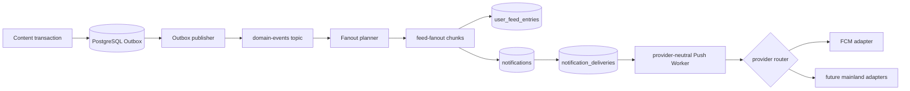

# Following feed and notification API

Base path: `/api/v1`

All endpoints in this document require:

```http
Authorization: Bearer {accessToken}
```

## App workflow

1. Register or log in and persist the access/refresh token pair.
2. Follow an author with `POST /users/{me}/following/{authorId}`.
3. Optionally enable new-content reminders with the preferences endpoint.
4. Load the following feed with cursor pagination.
5. Load notifications and the unread counter independently.
6. Register the device's selected push channel after login and disable it on logout.

Feed entries and notifications are separate products: publishing a post can add a
feed entry without creating a notification. A `new_post` notification is created
only when the follower explicitly enabled it.

## Following feed

```http
GET /feed/following?pageSize=20
GET /feed/following?pageSize=20&cursor={nextCursor}
```

Response:

```json
{
  "items": [],
  "nextCursor": "MTcxNDcyMzIwMAp2MDAz",
  "hasMore": true
}
```

Treat `nextCursor` as opaque. Send it unchanged for the next page. It is omitted
when `hasMore=false`. The server merges materialized entries for ordinary authors
with live content from high-follower authors and removes duplicates.

The legacy endpoint below remains available while the App migrates, but it is
limited to the first 50 items:

```http
GET /users/{me}/following-feed
```

## Follow preferences

```http
GET /users/{me}/following/{authorId}/preferences
PATCH /users/{me}/following/{authorId}/preferences
Content-Type: application/json

{
  "notifyNewContent": true,
  "muted": false
}
```

Response:

```json
{
  "targetUserId": "u003",
  "following": true,
  "notifyNewContent": true,
  "muted": false
}
```

`PATCH` returns `404` if the relationship does not exist. Muting removes existing
materialized entries for this author. Unmuting backfills up to
`FOLLOW_BACKFILL_SIZE` recent public posts.

## Notifications

```http
GET /me/notifications?pageSize=20
GET /me/notifications?pageSize=20&cursor={nextCursor}
GET /me/notifications/unread-count
POST /me/notifications/{notificationId}/read
POST /me/notifications/read-all
```

Notification page response:

```json
{
  "items": [
    {
      "id": "ntf_...",
      "receiverUserId": "usr_...",
      "actorUserId": "u003",
      "type": "new_post",
      "contentId": "cnt_...",
      "message": "An author you follow published a new post.",
      "read": false,
      "createdAt": "2026-07-11T14:48:29.498Z"
    }
  ],
  "nextCursor": null,
  "hasMore": false
}
```

Unread response:

```json
{
  "unreadCount": 1
}
```

The unread count is maintained incrementally and does not scan the notification
table on every request.

## Push recipients

Register or refresh a push recipient after login. Existing App requests remain
compatible because omitted `pushProvider` defaults to `fcm` and omitted
`recipientType` defaults to `token`:

```http
POST /me/devices
Content-Type: application/json

{
  "token": "fcm-registration-token",
  "platform": "android",
  "deviceName": "Pixel 8"
}
```

Register a mainland provider token with optional non-sensitive metadata:

```http
POST /me/devices
Content-Type: application/json

{
  "token": "vendor-registration-token",
  "platform": "android",
  "deviceName": "Mate 70",
  "recipientType": "token",
  "pushProvider": "huawei",
  "deviceBrand": "Huawei",
  "appPackage": "com.example.flowershow"
}
```

Allowed providers are `fcm`, `huawei`, `xiaomi`, `oppo`, and `vivo`.
Huawei/Xiaomi/OPPO/vivo accept only `recipientType=token`. Register an FCM
Firebase Installation ID (FID) by keeping the existing `token` field name and
setting both FCM and the recipient type:

```http
POST /me/devices
Content-Type: application/json

{
  "token": "firebase-installation-id",
  "recipientType": "fid",
  "pushProvider": "fcm",
  "platform": "android",
  "deviceName": "Pixel 8"
}
```

The response and `GET /me/devices` include the non-sensitive provider metadata,
but never include the actual registration token or FID:

```json
{
  "id": "dev_...",
  "platform": "android",
  "deviceName": "Pixel 8",
  "recipientType": "fid",
  "pushProvider": "fcm",
  "enabled": true,
  "lastSeenAt": "2026-07-24T12:00:00Z"
}
```

List and disable registrations:

```http
GET /me/devices
DELETE /me/devices/{deviceId}
```

Every inserted notification creates one idempotent `notification_deliveries` job
per enabled device. Remote push is disabled by default (`PUSH_ENABLED=false`):
delivery rows accumulate, no remote Worker runs, and in-app notification history
continues to work without any provider. PostgreSQL `notifications` and
`notification_deliveries` are the durable fact source.

When enabled, the Worker routes each delivery by the provider stored on its
device row. Phase 1 contains only an FCM adapter, using Firebase Admin Java SDK
9.10.0 and Google Application Default Credentials. Set
`GOOGLE_APPLICATION_CREDENTIALS` to a service-account JSON file outside the
repository and optionally set `FIREBASE_PROJECT_ID`. FIDs use
`Message.Builder.setFid`; legacy tokens use the deprecated but still compatible
`setToken`. Credentials are loaded lazily on the first actual FCM send.

`PUSH_PROVIDER` is deprecated and ignored; leaving the old environment variable
set does not select a global route. A provider without an adapter becomes
`dead` with `<PROVIDER>_PROVIDER_NOT_CONFIGURED`, without disabling the device.

The message contains both notification `title`/`body` and non-empty data with
`notificationId` and `type`; `actorUserId`, `contentId`, and `commentId` are
included when present. Android messages use the stable
`flower_show_notifications` channel by default, so the App must create the same
channel ID.

## Delivery architecture



The Outbox publisher uses `FOR UPDATE SKIP LOCKED` so multiple server instances can
publish concurrently. Kafka is at-least-once; all consumers use deterministic keys
and database uniqueness constraints so redelivery is safe. Failed records retry
with exponential backoff and end in the matching `.DLT` topic after recovery is
exhausted.

For authors at or below `FANOUT_ON_WRITE_MAX_FOLLOWERS` (default `100000`), followers
are scanned with keyset pagination and emitted in chunks (default `1000`). Above the
threshold, posts are merged into the feed at read time. New-content notifications
scan only the indexed opt-in subset, including for high-follower authors.

The Push Worker uses the same multi-instance-safe database pattern: it claims
due `pending`/`retry` deliveries with `FOR UPDATE SKIP LOCKED`, marks them
`processing` with a unique claim owner, commits, and performs network I/O outside
the transaction. A completion update must match that owner. Timed-out claims are
recovered, expired notifications become `dead`, and retryable failures use
bounded exponential backoff until the configured attempt limit.

`UNREGISTERED` and `SENDER_ID_MISMATCH` are invalid-recipient failures: the
current delivery becomes `dead`, the device is disabled, and its queued
deliveries are terminated. Quota, unavailable, internal, and unrecognized
transport failures retry. Explicit parameter, credential, and third-party
authentication failures become `dead` without disabling the device. Provider
errors use the actual provider prefix (for example `FCM_UNAVAILABLE` or
`HUAWEI_PROVIDER_NOT_CONFIGURED`); credentials, Authorization values, and
recipient values are not logged or copied to `last_error`.

The planned channel split keeps this PostgreSQL history as the source of truth,
prioritizes online WebSocket delivery next (not implemented), uses
Huawei/Xiaomi/OPPO/vivo or an approved aggregation channel for offline mainland
China, and uses FCM for GMS-capable/overseas devices. Phase 1 implements only the
provider-neutral contract and FCM adapter; mainland adapters still require
vendor accounts, app approval, and credentials. See
[Mainland China multi-channel push strategy](mainland-push-strategy.md).
